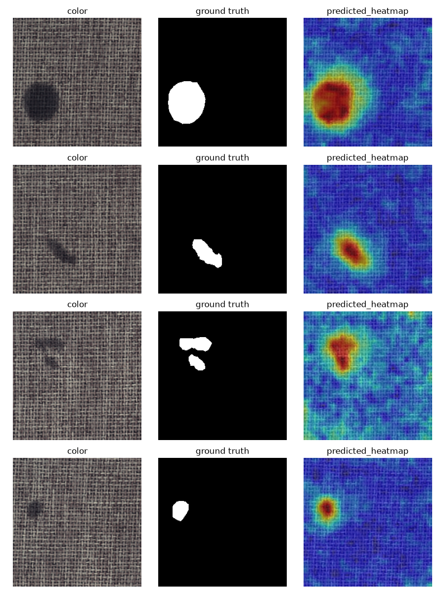

# 🔍 Industrial Visual Defect Inspection — Anomaly Detection & Localization

[](https://industrial-image-defect-inspection.streamlit.app)
[](https://python.org)
[](https://pytorch.org)
[](https://streamlit.io)

> Detects and localizes manufacturing defects from a single product photo — trained using only defect-free images, mirroring how real factories actually operate: defects are rare and varied, so you can never collect enough labeled examples of every possible flaw.

**[🚀 Try the Live Dashboard →](https://industrial-image-defect-inspection.streamlit.app)**



---

## 📌 Business Context

Every manufacturer running a production line — automotive, precision components, sheet-metal, pneumatics — performs visual quality inspection, manually or semi-automatically. Manual inspection is slow, inconsistent between inspectors, and doesn't scale with production volume; rule-based machine vision is brittle and needs re-tuning per defect type.

**Anomaly-detection-based inspection** changes this: instead of teaching a model every possible defect (which you'll never fully enumerate), it learns what a *normal* product looks like and flags meaningful deviations — new defect types included, with zero retraining. This project demonstrates a full pipeline for this exact problem, benchmarked against **MVTec AD**, the standard academic/industrial dataset for this use case, built by a German industrial imaging company.

---

## 📊 Results

### Image-level detection (AUROC)

| Category | PatchCore AUROC | Autoencoder AUROC |
|----------|:---:|:---:|
| carpet   | **0.9980** | 0.3848 |
| bottle   | **0.9992** | not evaluated |
| wood     | **0.9877** | not evaluated |

### Pixel-level localization

| Category | Pixel AUROC | Best IoU (oracle threshold) | Defective pixel fraction |
|----------|:---:|:---:|:---:|
| carpet   | 0.9893 | 0.4753 | 2.04% |
| bottle   | 0.9802 | 0.6014 | 7.52% |
| wood     | 0.9483 | 0.3391 | not separately logged |

> **Why AUROC and IoU disagree in ranking:** AUROC is a ranking metric, unaffected by defect size — carpet's small, sharp defects against uniform texture are easy to rank correctly, giving it the higher AUROC. IoU measures spatial overlap at a fixed threshold, and is sensitive to defect size relative to the model's fixed localization resolution (a 28×28 patch grid upsampled to 224×224). Bottle's defects are proportionally larger, so the same absolute localization imprecision costs it less in IoU terms than it costs carpet, despite bottle's slightly lower AUROC. Both metrics are reported because they measure genuinely different things.

### Live demo thresholds

| Category | Threshold |
|----------|:---:|
| carpet   | 3.806 |
| bottle   | 4.3088 |
| wood     | 4.1929 |

Thresholds are calibrated as the midpoint between the highest "good" test score and lowest "defective" test score, after an initial calibration attempt (99th percentile of *training*-set scores) proved too strict — training images score artificially low against a memory bank partly built from their own patches, which doesn't represent how a genuinely new normal image scores. All metrics and thresholds are computed by a single script (`scripts/finalize_category.py`) and stored in `outputs/category_config.json`, which the dashboard reads directly — nothing is hardcoded or manually retyped.

### Why PatchCore over a reconstruction autoencoder

A convolutional autoencoder (reconstruct normal images, flag high reconstruction error as anomalous) was implemented and evaluated as a comparison baseline. It scored **0.3848 AUROC on carpet** — worse than random guessing — versus PatchCore's 0.998. Visual inspection of reconstructions explains why: a well-trained autoencoder on repetitive texture learns general "carpet-like" patterns and partially reconstructs dark/irregular blobs as locally plausible texture, smoothing out the pixel-error signal exactly where it's needed most. This is a documented weakness of reconstruction-based anomaly detection.

Getting the autoencoder to train correctly also surfaced a real optimization bug: with a bias-initialized final layer, a standard learning rate (1e-3) caused Adam to immediately overshoot a good starting point in the first few gradient steps, plateauing the model at a *worse* loss (~0.41) than a trivial constant-color baseline (~0.013) for dozens of epochs. Lowering the learning rate 10x (to 1e-4) and adding gradient clipping fixed the instability, dropping final loss to ~0.002 — after which the reconstruction-quality limitation above became visible and measurable.

---

## 🗂️ Dataset

**MVTec AD (MVTec Anomaly Detection)** — 15 object/texture categories, ~5,354 images, CC BY-NC-SA 4.0 (non-commercial use with attribution).

- Training sets contain **only defect-free images** — this is anomaly detection, not supervised classification
- Test sets contain both normal and multiple defect types per category, with **pixel-level ground-truth masks**

This project evaluates three categories, chosen to show the approach generalizes across fundamentally different visual structure:

| Category | Type | Train | Test |
|----------|------|:---:|:---:|
| carpet | texture | 280 | 117 |
| bottle | object | 209 | 83 |
| wood | texture | 247 | 79 |

---

## 🏗️ Project Architecture

```
industrial-defect-inspection/
├── data/
│   └── raw/                      ← MVTec AD category folders (not tracked in git)
├── src/
│   ├── data/
│   │   └── dataset.py            ← MVTec-style loader (train/test, image+mask pairing)
│   ├── models/
│   │   ├── backbone.py           ← frozen WideResNet-50 patch feature extractor
│   │   ├── memory_bank.py        ← coreset selection, scoring, heatmap generation
│   │   └── autoencoder.py        ← comparison baseline
│   └── eval/
│       └── visualize.py          ← sanity-check and overlay helpers
├── scripts/
│   ├── build_memory_bank.py      ← build + save a category's memory bank (auto-manages .gitignore)
│   ├── finalize_category.py      ← compute AUROC/IoU/threshold → category_config.json
│   ├── visualize_heatmap.py      ← one-example-per-defect-type heatmap visualization
│   └── ...                       ← every other pipeline step as a runnable, documented entry point
├── app/
│   └── streamlit_app.py          ← live dashboard: category select, upload → score + heatmap
├── outputs/
│   ├── category_config.json      ← single source of truth: metrics + threshold per category
│   ├── memory_bank_<category>.pt ← saved coresets (committed — needed for the deployed demo)
│   └── heatmap_<category>.png    ← example localization visuals
└── requirements.txt
```

---

## 🔬 Methodology

### 1. Feature Extraction

A frozen, ImageNet-pretrained **WideResNet-50** extracts patch-level features — activations from `layer2` + `layer3` combined — giving a 28×28 grid of 1536-dim feature vectors per image, instead of a single whole-image descriptor. No backpropagation happens anywhere in this pipeline; the backbone's weights are never updated, and the "model" is literally the stored memory bank plus a distance lookup.

### 2. Memory Bank + Coreset Subsampling

Every normal training image's patch features are pooled into one large "memory bank" representing what normal looks like. This bank is reduced via **greedy coreset subsampling** (farthest-point / greedy k-center selection) down to a small, representative fraction of its original size — repeatedly picking the point currently worst-represented by what's already selected, which spreads the kept points evenly across the data instead of clustering in dense, redundant regions from repetitive texture.

### 3. Anomaly Scoring + Localization

At inference, each patch of a new image is compared to its nearest neighbor in the memory bank via Euclidean distance. The **image-level anomaly score is the max distance across all patches** (one bad patch is enough to flag the image). The full grid of per-patch distances, upsampled to image resolution, becomes the **defect localization heatmap**.

### 4. Threshold Calibration

Per-category decision thresholds are calibrated as the midpoint between the highest "good" test score and lowest "defective" test score — not an arbitrary percentile. An initial calibration attempt using training-set score percentiles proved too strict (training images score artificially low against a bank partly built from their own patches) and was corrected after validating against real labeled test data (see Results above).

### 5. Comparison Baseline

A convolutional autoencoder was separately implemented and evaluated to validate the choice of PatchCore over the simpler reconstruction-based approach — including diagnosing and fixing a real training instability bug — before confirming PatchCore's advantage with real, measured numbers rather than an assumption.

---

## 🚀 Run Locally

```bash
# Clone
git clone https://github.com/AniruddhMukherjee/industrial-defect-inspection
cd industrial-defect-inspection

# Set up environment
python3 -m venv .venv
source .venv/bin/activate
pip install -r requirements.txt
```

Download `carpet`, `bottle`, and `wood` from the [official MVTec AD downloads page](https://www.mvtec.com/company/research/datasets/mvtec-ad/downloads), then extract each into `data/raw/`:

```bash
mv ~/Downloads/carpet.tar.xz ~/Downloads/bottle.tar.xz ~/Downloads/wood.tar.xz data/raw/
cd data/raw
tar -xf carpet.tar.xz
tar -xf bottle.tar.xz
tar -xf wood.tar.xz
cd ../..
```

You should now have `data/raw/carpet/`, `data/raw/bottle/`, and `data/raw/wood/`, each with `train/`, `test/`, and `ground_truth/` subfolders.

Then, for each category:

```bash
# build the memory bank (a few minutes each on Apple Silicon MPS)
python -m scripts.build_memory_bank --category carpet
python -m scripts.build_memory_bank --category bottle
python -m scripts.build_memory_bank --category wood

# compute AUROC / pixel-AUROC / IoU / threshold, written to outputs/category_config.json
python -m scripts.finalize_category --category carpet
python -m scripts.finalize_category --category bottle
python -m scripts.finalize_category --category wood

# visualize a heat map with random images from the test set and access it in outputs (not a necessary step, just to confirm the heat maps are true)
python -m scripts.visualize_heatmap --category carpet --num-samples 5
python -m scripts.visualize_heatmap --category bottle --num-samples 5
python -m scripts.visualize_heatmap --category wood --num-samples 5
```

Finally, launch the dashboard — it reads `outputs/category_config.json` directly, so all three categories appear in the dropdown automatically:

```bash
streamlit run app/streamlit_app.py
```

All intermediate/diagnostic scripts (`check_*.py`, `sanity_check.py`, `visualize_heatmap.py`, `evaluate_detection.py`, `evaluate_localization.py`, etc.) are standalone, documented entry points under `scripts/` for inspecting each stage of the pipeline individually; they are not required for the steps above.

---

## ➕ Adding a New Category

The pipeline is fully data-driven — adding a new MVTec AD category (or any dataset following the same `train/test/ground_truth` folder structure) requires **no code changes**, only running the existing scripts against the new category name. This was validated directly while building this project: **wood** was added this way, after carpet and bottle were already working.

1. **Download and extract** the category into `data/raw/<category>/`:
```bash
   mv ~/Downloads/<category>.tar.xz data/raw/
   cd data/raw && tar -xf <category>.tar.xz && cd ../..
```

2. **Build its memory bank** — this also automatically adds the required `.gitignore` exception for the new category's saved bank, so it isn't silently excluded from version control:
```bash
   python -m scripts.build_memory_bank --category <category>
```

3. **Compute its metrics and threshold** — appends a new entry to `outputs/category_config.json` alongside any existing categories, without overwriting them:
```bash
   python -m scripts.finalize_category --category <category>
```

4. **Run the dashboard** — the new category appears in the dropdown automatically, since the app reads its list of categories directly from `category_config.json`:
```bash
   streamlit run app/streamlit_app.py
```

**One manual judgment call, by design:** `build_memory_bank.py`'s `--target-size` (default 2200) controls the coreset size and may be worth tuning per category — a texture category and a highly complex object category don't necessarily warrant the same reference-bank size. If a new category's AUROC comes out lower than expected, this is the first parameter to revisit rather than something to auto-tune blindly.

---

## 📈 Dashboard Features

- **Category Selection**: Switch between carpet, bottle, and wood — each with its own calibrated memory bank and threshold
- **Live Scoring**: Upload any image, get an anomaly score computed in real time (nothing precomputed per-image)
- **Localization Heatmap**: See exactly where the model thinks the defect is, overlaid on the uploaded image
- **Model Stats Sidebar**: AUROC, pixel-AUROC, IoU, dataset size, and threshold for the selected category, read live from `category_config.json`

---

## 🛠️ Tech Stack

| Category | Tools |
|----------|-------|
| ML/DL | PyTorch, torchvision |
| Image Processing | OpenCV, Pillow |
| Evaluation | Scikit-learn |
| Visualization | Matplotlib |
| Dashboard | Streamlit |
| Deployment | Streamlit Community Cloud |
| Development | VS Code, local (Apple Silicon / MPS) |

---

## ⚠️ Limitations

- **Fixed photographic conditions.** Like any real inspection-camera setup, this system is specialized to consistent lighting, framing, and background matching its training images — confirmed directly by testing a web-sourced carpet photo, which was flagged anomalous despite having no real defect, simply due to different lighting/camera/fiber characteristics than MVTec AD's own photos. This is by design, matching how real factory inspection stations work (one fixed camera per product line), not a shortcoming unique to this implementation.
- **Localization resolution is coarse.** The 28×28 patch grid, upsampled to image resolution, cannot produce pixel-precise boundaries — defect *location* is reliable, but boundary shape is approximate, which is reflected in the IoU numbers above.
- **Threshold calibration requires some labeled defective examples.** The reported thresholds were validated against MVTec AD's labeled test set. A genuinely new deployment with zero defective examples available would need to start with a conservative, normal-data-only threshold and refine it from live production feedback over time.
- **Three of fifteen MVTec AD categories evaluated**, chosen to represent texture and object defect types; the pipeline generalizes to the remaining categories via the same steps (see "Adding a New Category"), but their specific results are not yet measured.
- Dataset is licensed CC BY-NC-SA 4.0 — non-commercial use only.

---

## 👤 Author

**Aniruddh Mukherjee**
MSc INFOTECH — Universität Stuttgart (2026)
Published researcher (Springer) | Ex-Linde Engineering

[](https://github.com/AniruddhMukherjee)